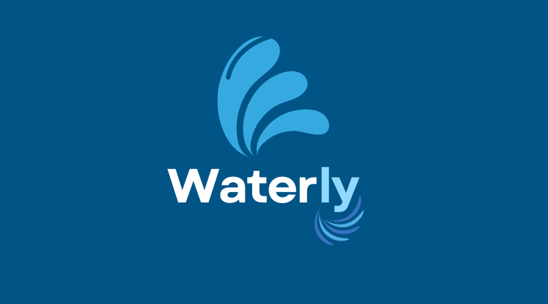
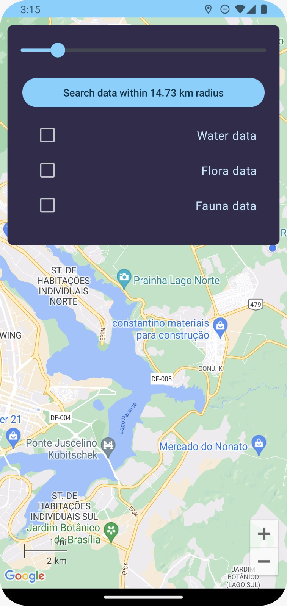
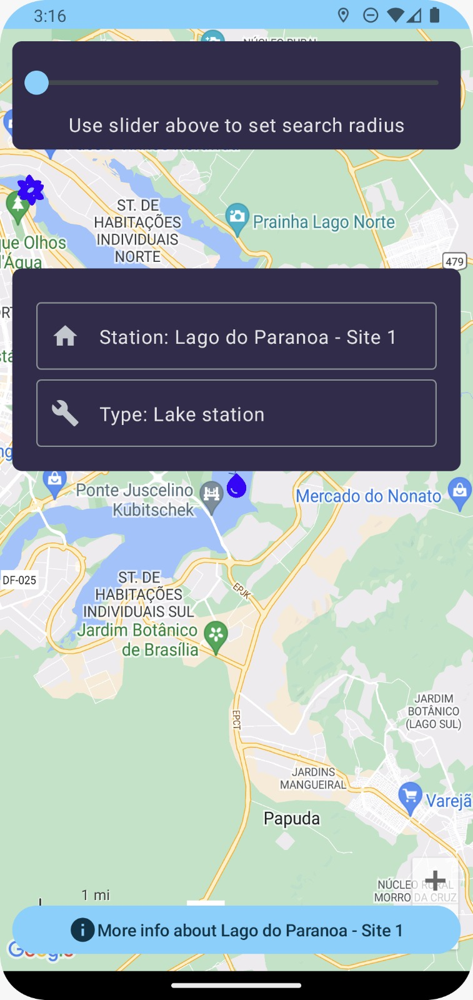
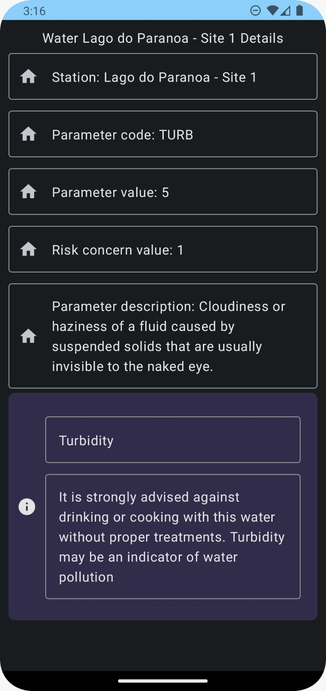
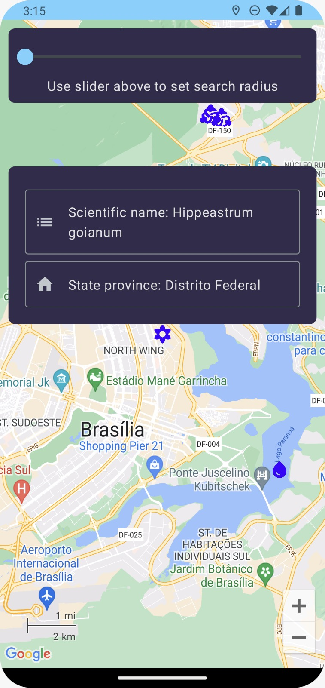
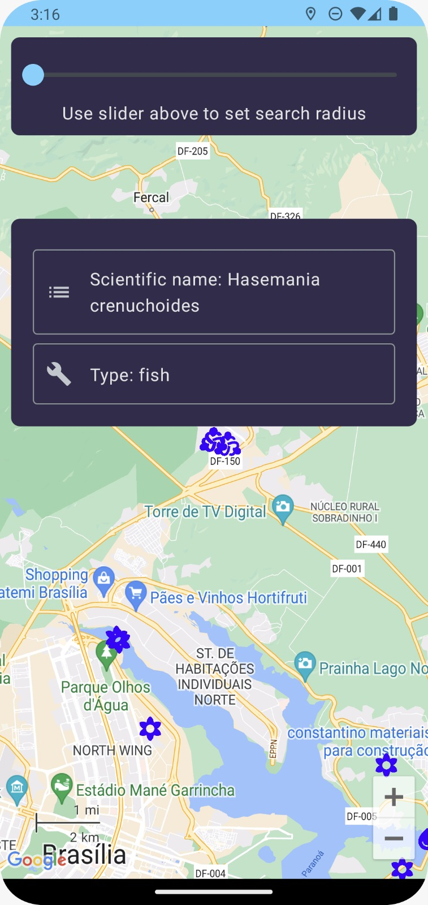

# Waterly 

## Table of Contents
- [Overview](#overview)
- [Features](#features)
- [Getting Started](#getting-started)
  - [Prerequisites](#prerequisites)
  - [Installation](#installation)
- [How to Use](#how-to-use)
- [Data Sources](#data-sources)
- [Health Information](#health-information)
- [Contributing](#contributing)

## Overview
Waterly is your all-in-one companion app for water quality, biodiversity, and environmental health. It empowers you to make informed decisions about the water you interact with, whether it's for drinking, recreational activities, or environmental conservation.

## Features
- **Water Quality Check:** Assess the safety of water bodies by checking for contaminants and other crucial parameters.
- **Fauna and Flora Information:** Explore the biodiversity of your region, including endangered species and native plants.
- **Safety Recommendations:** Receive tips for personal safety and wildlife preservation when interacting with water bodies.
- **User-Friendly Interface:** Intuitive design for easy navigation.
- **Lightweight and Accessible:** No need to store extensive data on your device; the app accesses real-time data sources.

## Getting Started
### Prerequisites
- Android device running Android 8 or later.

### Installation
1. Download the Waterly app from the [APK](waterly_app.apk) file.
2. Install the app on your device.
3. Open the app and start exploring!

## How to Use
- Open the app, allow location details and select the radius for search. (Currently Available only in Brazil)
- Browse water bodies, endangered fauna, endangered flora and safety recommendations.
- Click on icons or entries for detailed information.

  <table>
  <tr>
    <td align="center"></td>
    <td align="center"></td>
    <td align="center"></td>
    <td align="center"></td>
    <td align="center"></td>
  </tr>
</table>

## Data Sources
- **Water Data:** Provided by GEMStat from WHO.
- **Fauna and Flora:** Sourced from Sistema de Informação sobre a Biodiversidade Brasileira.

## Health Information
For health-related information and safety recommendations, we utilize sources from reputable health organizations. Detailed sources are available upon request.

## App Test Video

Watch a video demonstration of our app's features and functionalities:

## Colaborators

<table>
  <tr>
    </td>
    <td align="center">
      <a href="#">
         
        
          <b>João Runkel</b>
          
joaorunkel
        
      </a>
      </td>
    <td align="center">
      <a href="#">
         
        
          <b>Joaquim Gomes</b>
          
joaquim-og
        
      </a>
      </td>
    <td align="center">
      <a href="#">
         
        
          <b>Letícia Aires</b>
          
LeticiaAires
        
      </a>
      </td>
    <td align="center">
      <a href="#">
         
        
          <b>Otávio Maya</b>
          
knz13
        
      </a>

